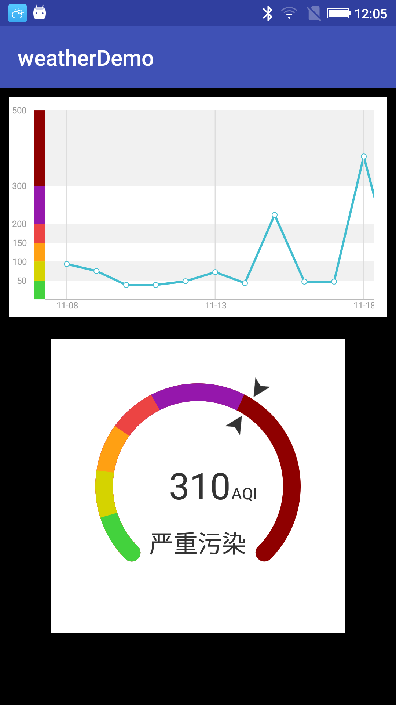

# WeatherAQIChart

这个是用来显示天气AQI值的控件

效果图如下:

## 接入步骤

1. 在工程添加jcenter依赖

        compile 'com.nicekun:weatherchartlib:1.0.0'

2. 在布局里面引入控件

        <?xml version="1.0" encoding="utf-8"?>
        <android.support.constraint.ConstraintLayout xmlns:android="http://schemas.android.com/apk/res/android"
            xmlns:app="http://schemas.android.com/apk/res-auto"
            xmlns:tools="http://schemas.android.com/tools"
            android:layout_width="match_parent"
            android:layout_height="match_parent"
            android:background="#000
        "
            tools:context=".MainActivity">

            <com.nicekun.weatherchartlib.PollutionTendChart
                android:id="@+id/poluutionchart"
                android:layout_width="match_parent"
                android:layout_height="wrap_content"
                android:layout_marginEnd="8dp"
                android:layout_marginLeft="8dp"
                android:layout_marginRight="8dp"
                android:layout_marginStart="8dp"
                android:layout_marginTop="8dp"
                app:layout_constraintEnd_toEndOf="parent"
                app:layout_constraintStart_toStartOf="parent"
                app:layout_constraintTop_toTopOf="parent" />

            <com.nicekun.weatherchartlib.PollutuinIndicatorPlate
                android:id="@+id/pullution_indicator_plate"
                android:layout_width="wrap_content"
                android:layout_height="wrap_content"
                android:layout_marginEnd="8dp"
                android:layout_marginLeft="8dp"
                android:layout_marginRight="8dp"
                android:layout_marginStart="8dp"
                android:layout_marginTop="20dp"
                app:layout_constraintEnd_toEndOf="parent"
                app:layout_constraintStart_toStartOf="parent"
                app:layout_constraintTop_toBottomOf="@id/poluutionchart" />

        </android.support.constraint.ConstraintLayout>

 3. 设置数据

            private void initView() {
                mPollutionTendChart = (PollutionTendChart) findViewById(R.id.poluutionchart);
                mPollutuinIndicatorPlate = (PollutuinIndicatorPlate) findViewById(R.id.pullution_indicator_plate);
            }

            private void initData() {
                Integer[] aqiData = {
                        94, 75, 38, 38, 48, 72, 43, 224, 47, 47, 378, 80, 77, 78, 100, null, 127, 109, 104, 86, 55, 58, 58, 65,
                        94, 75, 38, 38, 48, 72, 43, 224, 47, 47, 378, 80, 77, 78, 100, null, 127, 109, 104, 86, 55, 58, 58, 65
                };

                Calendar instance = Calendar.getInstance();
                instance.set(Calendar.DAY_OF_MONTH, 8);
                Date time = instance.getTime();

                PollutionTendChartData pollutionTendChartData = new PollutionTendChartData.PollutionTendChartDataBuilder(aqiData, PollutionTendChartData.DataType.DAY)
                .setForcastFirstPointDate(time)
                .build();

                mPollutionTendChart.setData(pollutionTendChartData);

                mPollutuinIndicatorPlate.setAQI(310);
            }